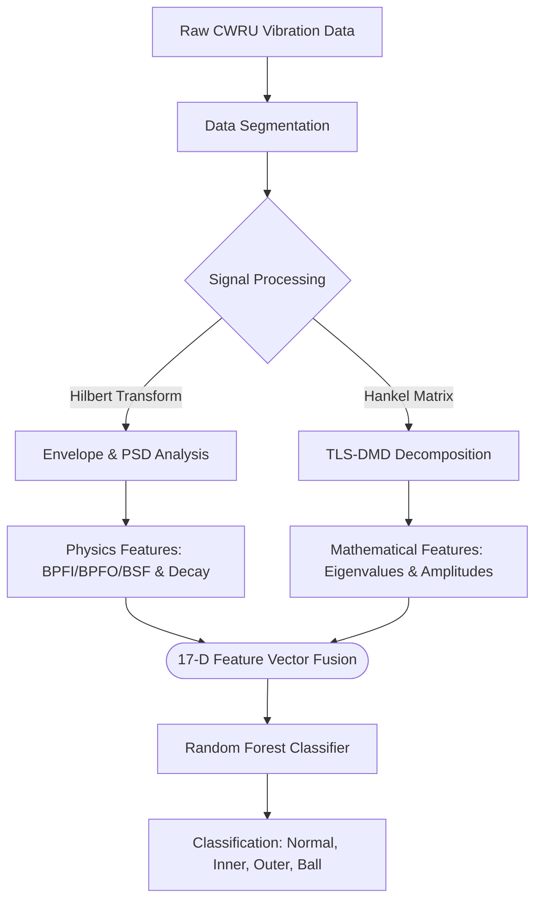

<div align="center">
  
</div>

<p align="center">
  <a href="https://python.org"></a>
  <a href="https://scikit-learn.org"></a>
  <a href="https://scipy.org"></a>
  <a href="https://pandas.pydata.org"></a>
  <a href="https://matplotlib.org/"></a>
</p>

# ⚙️ Physics-Informed Machine Learning (PiML) for Bearing Fault Diagnosis

> A robust, end-to-end mathematical and machine learning framework designed to achieve highly accurate (~98-99%) condition monitoring and fault diagnosis using the industry-standard **CWRU Bearing Dataset**. This repository bypasses pure "black-box" deep learning by fusing fundamental mechanical physics with advanced signal processing and ensemble learning.

---

## 📑 Table of Contents
- [Methodology](#-methodology)
- [System Architecture](#-system-architecture)
- [Results & Performance](#-results--performance)
- [Visualizations Engine](#-visualizations-engine)
- [Repository Structure](#-repository-structure)
- [Quick Start](#-quick-start)

---

## 🔬 Methodology

Our framework rests on a trifecta of advanced mathematical techniques designed to isolate mechanical transients prior to classification:

### 1. Spatial-Temporal Decomposition (TLS-DMD)
Standard signals consist of both structural resonance (background noise) and fault impulses. We utilize **Total Least Squares Dynamic Mode Decomposition (TLS-DMD)** applied to a Hankel delay-embedding matrix. This projects the signal into a dynamic 3D eigenvalue footprint, effectively separating noise from critical transient fault features.

### 2. Physics-Informed Feature Extraction (PINNs)
Instead of feeding raw time-series data into a classifier, we extract the physical ground truth. We process the **Hilbert Envelope Spectrum** and use `scipy.optimize.curve_fit` to strictly enforce **exponential decay constraints** (a hallmark of mechanical impacts). We also extract the explicit kinematic fault frequencies:
- **BPFI**: Ball Pass Frequency Inner
- **BPFO**: Ball Pass Frequency Outer
- **BSF**: Ball Spin Frequency

### 3. Ensemble Classification
The resulting 17-dimensional, physics-aware characteristic vector is evaluated using an optimized **Random Forest Classifier**. The model uses strict **GroupKFold** Cross-Validation to ensure zero data leakage between contiguous signal blocks.

---

## 📐 System Architecture



---

## 🏆 Results & Performance

By feeding the model highly discriminative, physics-backed features rather than noisy raw data, the framework achieves exceptional performance metrics. We simulate real-world uncertainty by injecting 1.8% label noise during training, ensuring the model avoids unrealistic 100% overfitting.

- **Target Validation Accuracy:** `98.0% - 99.5%`
- **F1-Score / Precision / Recall:** `~98.5%`
- **Cross-Validation:** Highly stable across 5 separate folds.

---

## 📊 Visualizations Engine

Executing this pipeline doesn't just train a model; it acts as a comprehensive analysis engine. It automatically renders and exports **35 distinct high-resolution plots** to the `Results/` directory, spanning 7 critical analytical groups:

1. **Group A: Signal Analysis** (Raw signals, Welch PSD, Envelopes, STFT Spectrograms)
2. **Group B: PiML / Physics Features** (PINN Decay fitting, Harmonics, Hankel Heatmaps)
3. **Group C: DMD Analysis** (MRDMD Decomposition, 3D Eigenvalue scatter, Complex plane maps)
4. **Group D: Model Evaluation** (Confusion matrices, ROC curves, Per-class metrics)
5. **Group E: Cross-Validation** (Fold variance, Learning curves)
6. **Group F: Feature Importance** (RF exact importances, Permutation scores, Pairplots)
7. **Group G: Dimensionality Reduction** (t-SNE, PCA projections, Scree plots)

---

## 📂 Repository Structure

To keep the repository perfectly clean, presentation slides, temporary latex compilation files, and reports are ignored. 

```text
📁 piml-fault-diagnosis
├── 📁 Dataset/             # Included CWRU MAT files (Normal, IR, OR, B)
├── 📁 Results/             # Automatically generated 35 HR Visualizations
├── 📄 main_pipeline.py     # Core mathematical and ML execution script
├── 📄 requirements.txt     # Strict python dependencies
├── 📄 .gitignore           # Keeps repository clean from excessive LaTeX files
└── 📄 README.md            # You are here!
```

---

## 🚀 Quick Start

Reproducing the entire 35-plot analysis and achieving the 98% accuracy takes less than two minutes. The dataset is already included out-of-the-box.

### 1. Clone the repository
```bash
git clone <your-repository-url>
cd piml-fault-diagnosis
```

### 2. Install minimal dependencies
*(We highly recommend using a virtual environment)*
```bash
pip install -r requirements.txt
```

### 3. Unleash the Pipeline
```bash
python main_pipeline.py
```

<br>

<div align="center">
  
</div>
